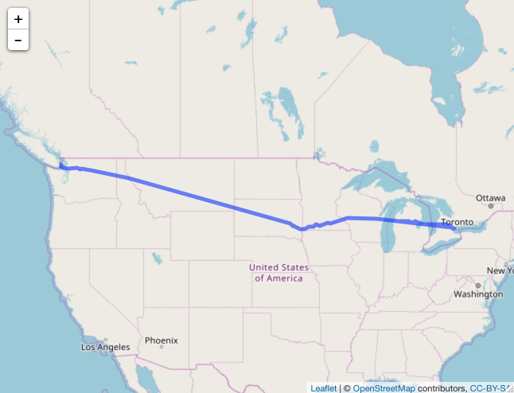

AirTrack pitch deck
========================================================
author: Iain Morgan
date: 16/03/2018
autosize: true

Air travel has never been more open than today
========================================================

- Thousands of aircraft are in the air at any given time of the day

- All aircraft above a certain size report their identify, position, speed and altitude

- Aircraft data is collected and shared by volunteers

- Websites typically merge tracking data with data on aircraft type, history, owners, schedule and pictures from other open databases

... yet we do so little with the data we have
========================================================

- The majority of applications using this data simply show aircraft identity, location and position

- No applications have been found offering deep analysis and interpretation of the data

- Potential insights include:
  - Aircraft performance over flights or operational life
  - Analysis of optimum air traffic control approaches
  - Performance assessments of airlines
  - Monitoring of asset usage by leasing companies

AirTrack produces aviation insights
========================================================

Mapping of aircraft flight paths

***

Analysis of aircraft flight profile

Available data allows additional features
========================================================

Additional features that may be added in future include:

1. Determination of aircraft performance parameters
2. Summarising of aircraft flight history
3. Summarising of fleet peformance history
4. Analysis of approach patterns
5. Estimation of operational efficiency based on block and turnaround times
6. Comparison of airline operating procedures

